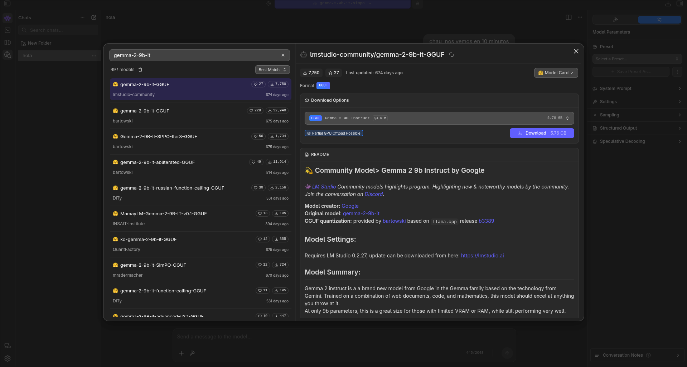
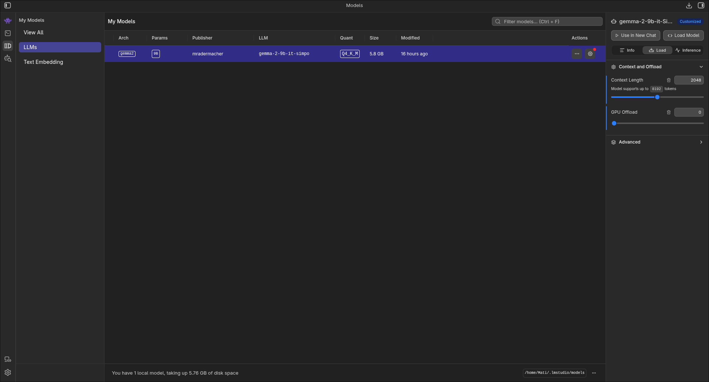
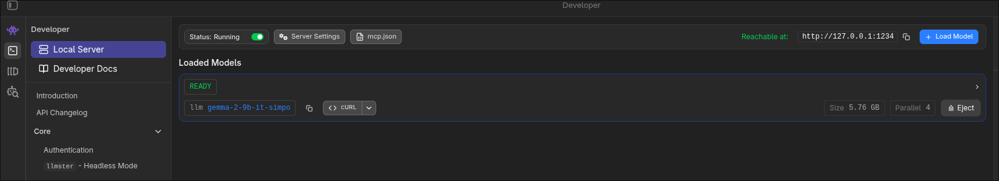

# Latam-Eval-Framework

Framework de evaluación agnóstico y robusto para medir el desempeño de LatamGPT frente a otros modelos fundacionales (ALIA, GPT, Gemini, Claude, Llama, Gemma, etc.), con un enfoque particular en lenguas indígenas americanas como el Guaraní.

## Características (Entregable 1)
- **Arquitectura Multimodelo:** Basada en el patrón `Strategy/Adapter` para la fácil integración de diversos proveedores (OpenAI, LangChain/OpenRouter, Mocking local).
- **Gestión de Dataset:** Carga estructurada de pares de instrucciones y respuestas.
- **Configuración Modular:** Configuración basada en archivos `YAML`.
- **Código Pythonico:** Implementación siguiendo `PEP8` y con cobertura total de `docstrings`.

## Estructura del Proyecto

```
latam-eval-framework/
│
├── latam_eval/
│   ├── models/                # Adaptadores de LLMs (Base, OpenAI, Langchain, Mock)
│   ├── datasets/              # Manejo y carga de datos JSON/JSONL
│   ├── utils/                 # Herramientas utilitarias (e.g. lector de config)

## Requisitos y Configuración

1. Instalar dependencias:
   ```bash
   pip install -r requirements.txt
   ```
2. Configurar variables de entorno si se utilizarán las API reales (no mocks):
   ```bash
   export GEMINI_API_KEY="AIt-..."
   export GROQ_API_KEY="gsk-..."
   ```
3. Activar el entorno virtual
   ```bash
   source .venv/bin/activate
   ```
# Configuración de Modelos Locales (Local Gemma)
Para evaluar usando local-gemma sin depender de APIs externas ni gastar créditos, el framework se conecta a un servidor local compatible con la API de OpenAI corriendo en el puerto 1234.
## Pasos
Abre LM Studio.

Descargar Gemma: Asegúrate de tener descargada una variante de Gemma (ej. gemma-2-9b-it). 


Una vez descargado, ve a la pestaña de Chat (el ícono de la burbuja de diálogo). En la parte superior de la pantalla verás un desplegable que dice "Select a model to load". Haz clic ahí y selecciona el archivo GGUF de Gemma-2 que acabas de bajar. (no pongo foto porque ya no me aparece la opción)

Configurar el LLM a gusto, yo por ejemplo que no tengo gráfica dedicada y solo 8gb de ram, mim configuración (ver a la derecha) terminó siendo esta:


Iniciar el Servidor: Inicia el servidor de inferencia local en http://127.0.0.1:1234. El adapter le apuntará automáticamente al endpoint de chat (http://127.0.0.1:1234/v1).


## Uso y Ejecución (CLI)

Para el Entregable 2, el framework cuenta con una interfaz de línea de comandos (CLI) llamada `eval-llm`. Una vez activado tu entorno virtual y con el paquete instalado, puedes ejecutar evaluaciones completas de dos maneras: mediante parámetros directos o usando un archivo de configuración.

### Opción 1: Usando un Archivo de Configuración (Recomendado)
El sistema soporta definir los parámetros de evaluación mediante un archivo YAML.

```bash
eval-llm --config config.yaml
```

**Ejemplo de `config.yaml`:**
```yaml
models:
  - llama-3.1-8b-instant
  - gemini-3.1-flash-lite
  - local-gemma
dataset: data/dataset_guarani_2.json
output: report.json
parameters:
  temperature: 0.7
  top_p: 0.9
```

y el .json de las datasets tienen esta estructura:
```json
{
    "id": "q4",
    "category": "traduccion",
    "instruction": "Traduce 'El sol está muy caliente hoy' al guaraní.",
    "expected_response": "Kuarahy hakueterei ko árape."
  }
```

### Opción 2: Usando Parámetros por Línea de Comandos

```bash
eval-llm --models <lista_de_modelos> --dataset <ruta_al_json> --output <archivo_salida>
```

### Parámetros
- `--models`: Lista de modelos separados por coma. **Importante:** Usa nombres exactos de versión para modelos reales para evitar errores (ej. `gemini-1.5-flash`, `gpt-4o`). 
  - *Modelos soportados:* `gpt-4o`, `gemini-1.5-flash`, `llama3-8b-8192`, `mock`, `local-gemma`.
  - *Nota sobre Grok y Llama:* Se procesan a través de la API de Groq si incluyen la palabra `llama`.
  - *Para ver los modelos disponibles de Gemini:* Ejecuta `curl "https://generativelanguage.googleapis.com/v1beta/models?key=$GEMINI_API_KEY"`
- `--dataset`: Ruta al archivo JSON con el dataset de prueba.
- `--config`: Ruta al archivo de configuración YAML (Si se usa, `--models` y `--dataset` son opcionales).
- `--output`: (Opcional) Ruta donde se guardará el reporte. Por defecto es `results.json`.

### Ejemplos rápidos

**1. Evaluación con modelo local y mock:**
```bash
eval-llm --models local-gemma,mock --dataset data/dataset_guarani_2.json --output report.json
```

**2. Ejecución mediante script de python:**
```bash
python examples/run_simple_eval.py
```
