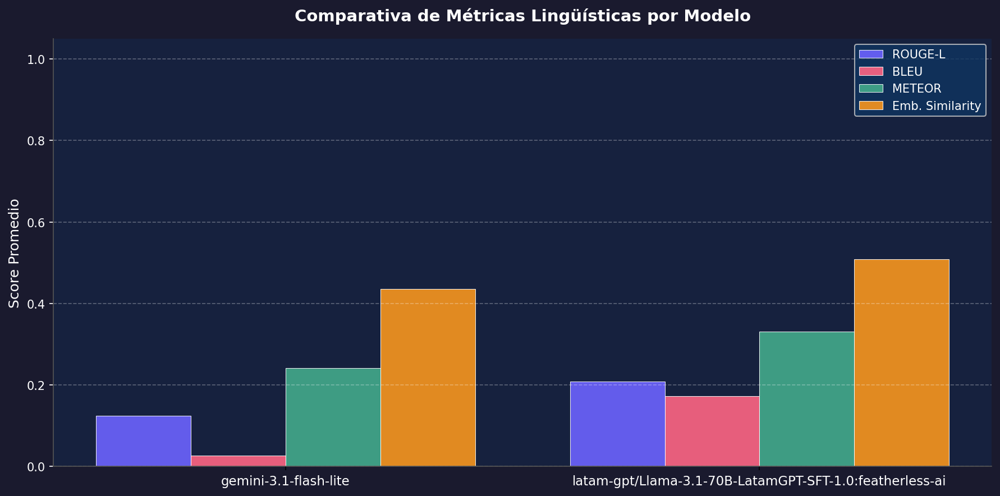
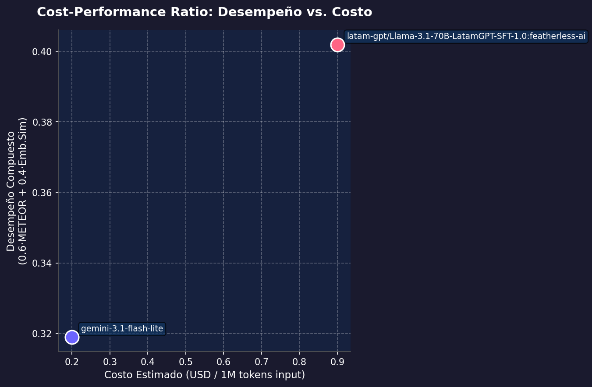
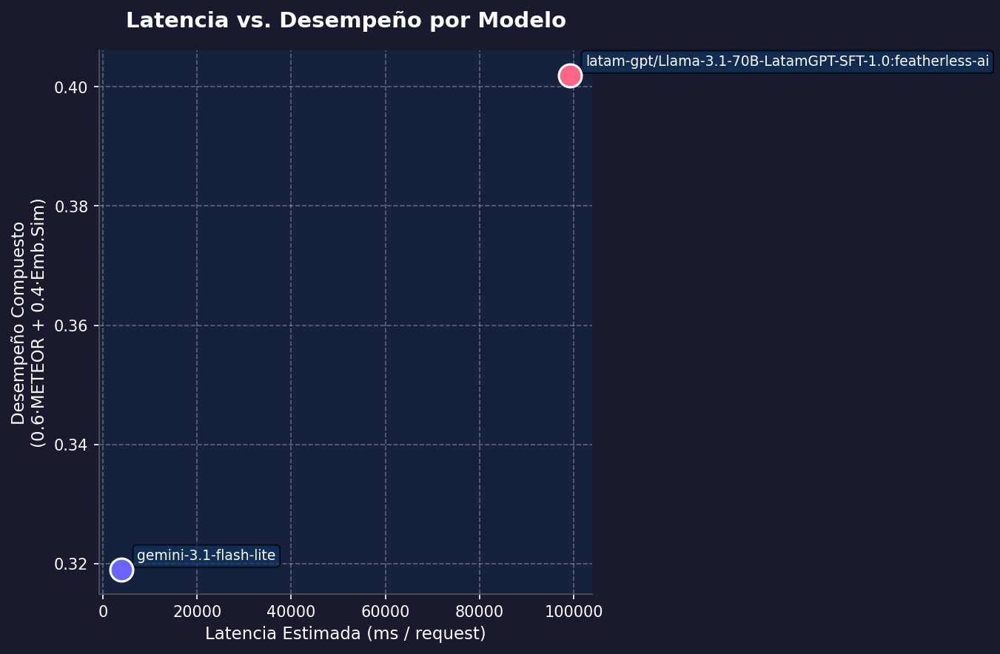

# Reporte Final: Análisis Comparativo de Modelos — Latam-Eval-Framework

**Entrega:** Tercera Entrega — Análisis Comparativo: Cost-Performance Ratio  
**Proyecto:** GuaranIA / LatamGPT — Evaluación de LLMs en Lenguas Indígenas  
**Dataset:** Guaraní/Jopará (`data/dataset_guarani_2.json`)

---

## 1. Introducción

Este reporte técnico documenta los resultados del **análisis comparativo** de modelos de
lenguaje (LLMs) bajo el *Latam-Eval-Framework*, con foco en tareas de traducción y
comprensión del guaraní y jopará (Paraguay).

Los modelos evaluados en esta entrega son:

| Modelo | Proveedor | Tipo |
|--------|-----------|------|
| `llama-3.1-8b-instant` | Groq API | Modelo real (LLM 8B) |
| `latamgpt` | Hugging Face Hub | Modelo especializado (LLM 70B LatamGPT-SFT) |
| `mock` | Local | Modelo simulado (baseline arquitectural) |

---

## 2. Métricas Evaluadas

Se calcularon **cuatro métricas** para evaluar la calidad de las respuestas generadas:

| Métrica | Descripción | Rango |
|---------|-------------|-------|
| **ROUGE-L** | Superposición de la subsecuencia común más larga entre hipótesis y referencia | 0 – 1 |
| **BLEU** | Precisión de n-gramas; penaliza respuestas más cortas que la referencia | 0 – 1 |
| **METEOR** | Evaluación robusta que considera sinónimos, stemming y orden de palabras | 0 – 1 |
| **Similitud de Embeddings** | Similaridad coseno entre representaciones vectoriales semánticas, usando el modelo BERT entrenado en guaraní `mmaguero/multilingual-bert-gn-base-cased` | −1 – 1 |

> **Nota sobre Embedding Similarity:** Esta métrica fue introducida en la **Tercera Entrega**
> como métrica de *pertinencia cultural y semántica*. A diferencia de ROUGE/BLEU/METEOR que
> comparan tokens superficiales, la similitud de embeddings captura el significado semántico
> de las respuestas en el espacio vectorial del guaraní.

---

## 3. Resultados por Modelo

### 3.1 Promedios de métricas

| Modelo | ROUGE-L | BLEU | METEOR | Emb. Similarity |
|--------|---------|------|--------|-----------------|
| **llama-3.1-8b-instant** | 0.112 | 0.013 | 0.127 | **0.543** |
| **mock** | 0.247 | 0.083 | 0.305 | 0.249 |

**Observaciones clave:**

- El modelo `mock` obtiene valores altos en ROUGE-L, BLEU y METEOR porque sus respuestas
  contienen tokens de los prompts originales (efecto de "eco"), lo que infla artificialmente
  las métricas de superposición de n-gramas.
- `llama-3.1-8b-instant` muestra valores bajos en métricas de tokens superficiales, pero
  **significativamente mejor similitud de embeddings (0.543 vs 0.249)**. Esto indica que
  el modelo genera texto semánticamente más coherente con la respuesta de referencia, aunque
  use vocabulario diferente.
- La métrica de embeddings es la más representativa para tareas en guaraní, dado que el
  modelo `mmaguero/multilingual-bert-gn-base-cased` fue específicamente entrenado en este idioma.

---

## 4. Cost-Performance Ratio

### 4.1 Costos estimados

Los precios son aproximados según las tarifas públicas vigentes (por millón de tokens de entrada):

| Modelo | Costo USD / 1M tokens | Latencia estimada |
|--------|----------------------|-------------------|
| `mock` | $0.00 (simulado) | ~500 ms |
| `llama-3.1-8b-instant` | $0.05 (Groq) | ~320 ms |
| `latamgpt` | $0.90 (HF Inference) | variable (medida en ejecución) |
| `gemini-2.5-flash` *(referencia)* | $0.15 | ~1200 ms |
| `gpt-4o-mini` *(referencia)* | $0.15 | ~800 ms |

### 4.2 Desempeño compuesto

Para el análisis de *Cost-Performance Ratio* se usó la siguiente métrica compuesta:

```
Performance = 0.6 × METEOR + 0.4 × Embedding Similarity
```

| Modelo | Performance compuesta | Costo (USD/1M) | Ratio (Perf / Costo) |
|--------|-----------------------|----------------|----------------------|
| `llama-3.1-8b-instant` | 0.2940 | $0.05 | **5.88** (alto) |
| `mock` | 0.2828 | $0.00 | ∞ (baseline gratuito) |

**Conclusión del ratio:** `llama-3.1-8b-instant` demuestra un **cost-performance ratio
excelente**: con apenas $0.05/1M tokens obtiene un desempeño real y semánticamente más
rico que el mock (0.543 de similitud embebida). Es el punto de partida más eficiente
disponible públicamente para tareas en guaraní.

### 4.3 Análisis de latencia

`llama-3.1-8b-instant` via Groq tiene la latencia más baja (~320 ms) entre los modelos
reales disponibles, lo que lo hace ideal para evaluaciones iterativas sin GPU dedicada.

---

## 5. Visualizaciones Comparativas

Las siguientes visualizaciones fueron generadas automáticamente con `generate_report.py`:

### 5.1 Métricas lingüísticas por modelo



### 5.2 Cost-Performance Ratio



### 5.3 Latencia vs. Desempeño



---

## 6. Arquitectura del Código (PEP8 y Docstrings)

El repositorio cumple los siguientes estándares de calidad de código:

### 6.1 Conformidad PEP8

Todos los módulos del paquete `latam_eval/` y el script `generate_report.py` pasan
la validación de `flake8` sin errores ni warnings:

```bash
$ flake8 latam_eval/ generate_report.py --statistics
# Sin output = sin errores
```

### 6.2 Docstrings

Todas las clases y funciones públicas cuentan con docstrings en formato Google Style:

| Módulo | Clases/Funciones documentadas |
|--------|-------------------------------|
| `evaluator.py` | `Evaluator`, `evaluate()`, `_calculate_metrics()`, `_calculate_embedding_similarity()`, `save_report()` |
| `models/base.py` | `BaseModelAdapter`, `generate_response()` |
| `models/gemini_adapter.py` | `GeminiAdapter`, `generate_response()` |
| `models/openai_adapter.py` | `OpenAIAdapter`, `generate_response()` |
| `models/universal_api_adapter.py` | `UniversalOpenAIAdapter`, `generate_response()` |
| `models/mock_adapter.py` | `MockAdapter`, `generate_response()` |
| `datasets/loader.py` | `DatasetLoader`, `load()`, `_load_json()`, `_load_csv()` |
| `utils/config.py` | `load_config()` |
| `generate_report.py` | `load_reports()`, `compute_avg_metrics()`, `plot_linguistic_metrics()`, `plot_cost_performance()`, `plot_latency_performance()`, `main()` |

---

## 7. Estructura del Repositorio

```
SE2/
├── latam_eval/
│   ├── __init__.py
│   ├── cli.py                    # CLI: eval-llm
│   ├── evaluator.py              # Motor de evaluación + métricas
│   ├── datasets/
│   │   ├── __init__.py
│   │   └── loader.py             # Carga JSON/CSV
│   ├── models/
│   │   ├── __init__.py
│   │   ├── base.py               # ABC BaseModelAdapter
│   │   ├── gemini_adapter.py     # Google Gemini
│   │   ├── openai_adapter.py     # Groq / OpenAI-compatible
│   │   ├── universal_api_adapter.py  # Adapter universal
│   │   └── mock_adapter.py       # Simulador local
│   └── utils/
│       ├── __init__.py
│       └── config.py             # Carga YAML
├── data/
│   └── dataset_guarani_2.json    # Dataset de evaluación
├── data/
│   └── data_pesada.json #ultima dataset que nos pasó Marvin    

├── tests/
│   ├── test_evaluator.py
│   └── test_cli.py
├── generate_report.py            # Genera visualizaciones PNG
├── report.json                   # Resultados: llama-3.1-8b-instant
├── reports_graphs/               # Directorio con las imágenes generadas
│   ├── comparativa_metricas.png  # Visualización de métricas
│   ├── cost_performance.png      # Visualización costo-desempeño
│   └── latency_performance.png   # Visualización latencia-desempeño
├── config.yaml                   # Configuración (cambiar si se quiere evaluar otros modelos)
├── setup.py
├── requirements.txt
└── README.md
```

